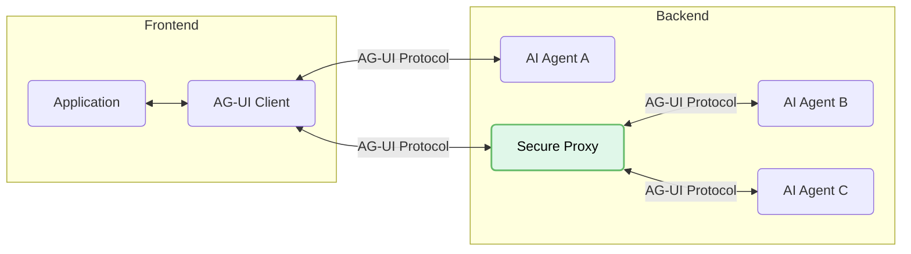
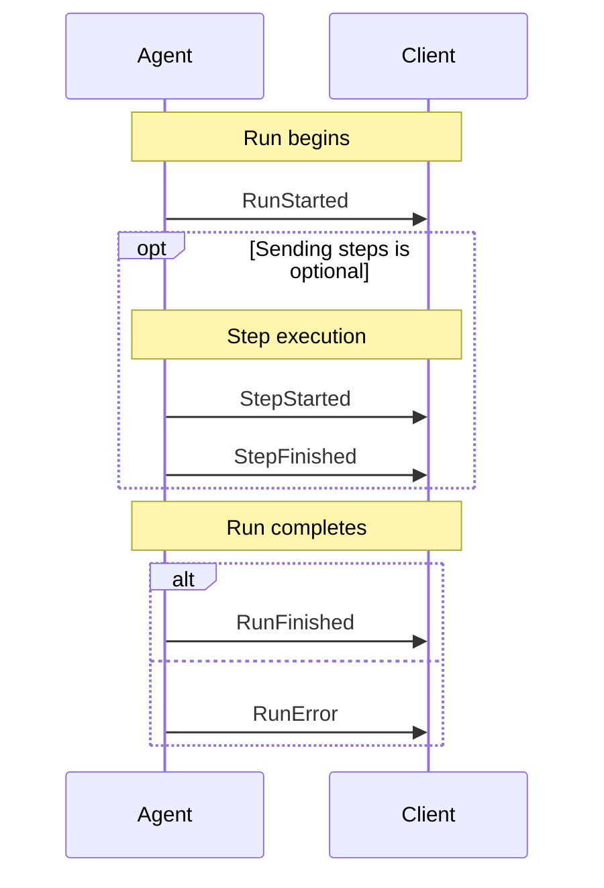
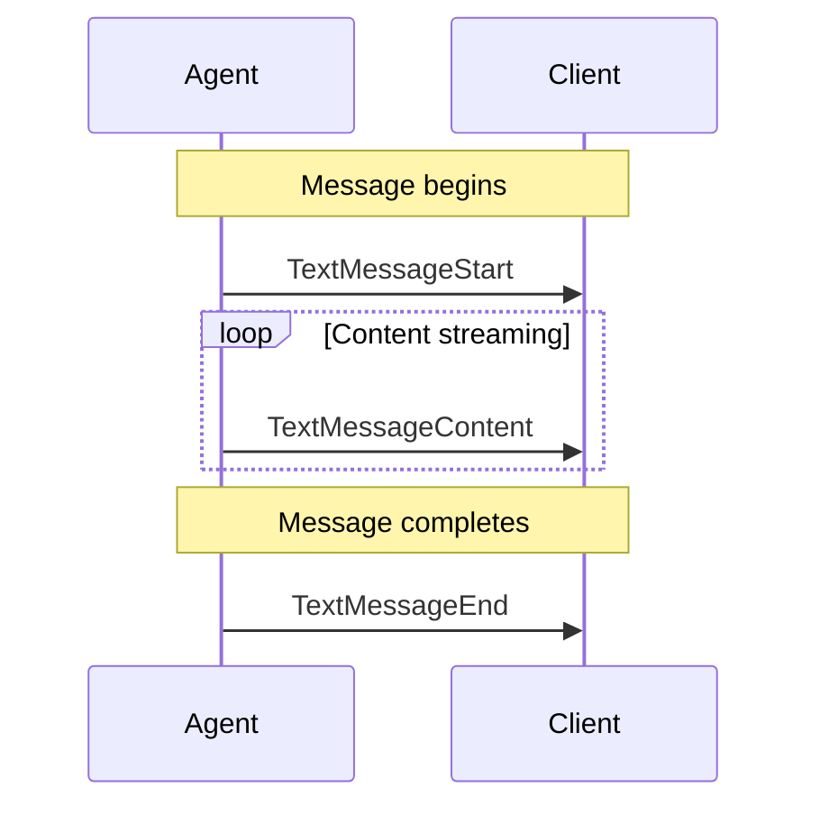
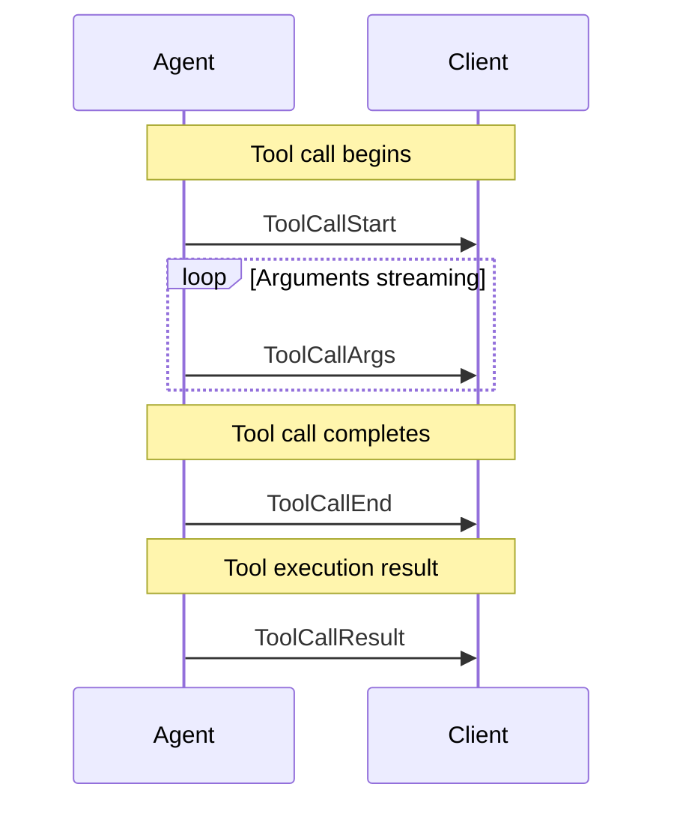
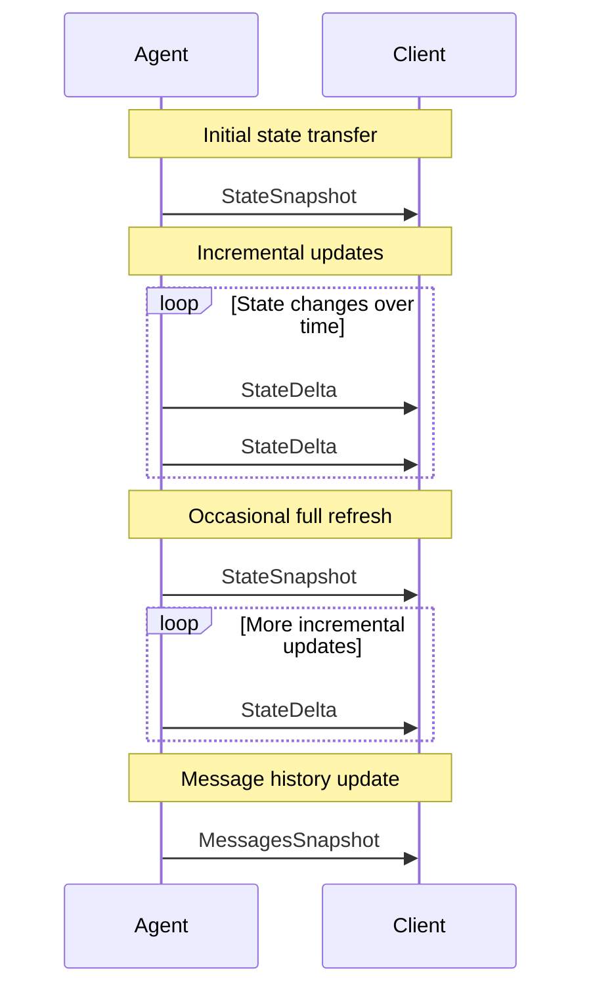

# Agents
Source: https://docs.ag-ui.com/concepts/agents

Learn about agents in the Agent User Interaction Protocol

# Agents

Agents are the core components in the AG-UI protocol that process requests and
generate responses. They establish a standardized way for front-end applications
to communicate with AI services through a consistent interface, regardless of
the underlying implementation.

## What is an Agent?

In AG-UI, an agent is a class that:

1. Manages conversation state and message history
2. Processes incoming messages and context
3. Generates responses through an event-driven streaming interface
4. Follows a standardized protocol for communication

Agents can be implemented to connect with any AI service, including:

* Large language models (LLMs) like GPT-4 or Claude
* Custom AI systems
* Retrieval augmented generation (RAG) systems
* Multi-agent systems

## Agent Architecture

All agents in AG-UI extend the `AbstractAgent` class, which provides the
foundation for:

* State management
* Message history tracking
* Event stream processing
* Tool usage

```typescript  theme={null}
import { AbstractAgent } from "@ag-ui/client"

class MyAgent extends AbstractAgent {
  run(input: RunAgentInput): RunAgent {
    // Implementation details
  }
}
```

### Core Components

AG-UI agents have several key components:

1. **Configuration**: Agent ID, thread ID, and initial state
2. **Messages**: Conversation history with user and assistant messages
3. **State**: Structured data that persists across interactions
4. **Events**: Standardized messages for communication with clients
5. **Tools**: Functions that agents can use to interact with external systems

## Agent Types

AG-UI provides different agent implementations to suit various needs:

### AbstractAgent

The base class that all agents extend. It handles core event processing, state
management, and message history.

### HttpAgent

A concrete implementation that connects to remote AI services via HTTP:

```typescript  theme={null}
import { HttpAgent } from "@ag-ui/client"

const agent = new HttpAgent({
  url: "https://your-agent-endpoint.com/agent",
  headers: {
    Authorization: "Bearer your-api-key",
  },
})
```

### Custom Agents

You can create custom agents to integrate with any AI service by extending
`AbstractAgent`:

```typescript  theme={null}
class CustomAgent extends AbstractAgent {
  // Custom properties and methods

  run(input: RunAgentInput): RunAgent {
    // Implement the agent's logic
  }
}
```

## Implementing Agents

### Basic Implementation

To create a custom agent, extend the `AbstractAgent` class and implement the
required `run` method:

```typescript  theme={null}
import {
  AbstractAgent,
  RunAgent,
  RunAgentInput,
  EventType,
  BaseEvent,
} from "@ag-ui/client"
import { Observable } from "rxjs"

class SimpleAgent extends AbstractAgent {
  run(input: RunAgentInput): RunAgent {
    const { threadId, runId } = input

    return () =>
      new Observable<BaseEvent>((observer) => {
        // Emit RUN_STARTED event
        observer.next({
          type: EventType.RUN_STARTED,
          threadId,
          runId,
        })

        // Send a message
        const messageId = Date.now().toString()

        // Message start
        observer.next({
          type: EventType.TEXT_MESSAGE_START,
          messageId,
          role: "assistant",
        })

        // Message content
        observer.next({
          type: EventType.TEXT_MESSAGE_CONTENT,
          messageId,
          delta: "Hello, world!",
        })

        // Message end
        observer.next({
          type: EventType.TEXT_MESSAGE_END,
          messageId,
        })

        // Emit RUN_FINISHED event
        observer.next({
          type: EventType.RUN_FINISHED,
          threadId,
          runId,
        })

        // Complete the observable
        observer.complete()
      })
  }
}
```

## Agent Capabilities

Agents in the AG-UI protocol provide a rich set of capabilities that enable
sophisticated AI interactions:

### Interactive Communication

Agents establish bi-directional communication channels with front-end
applications through event streams. This enables:

* Real-time streaming responses character-by-character
* Immediate feedback loops between user and AI
* Progress indicators for long-running operations
* Structured data exchange in both directions

### Tool Usage

Agents can use tools to perform actions and access external resources.
Importantly, tools are defined and passed in from the front-end application to
the agent, allowing for a flexible and extensible system:

```typescript  theme={null}
// Tool definition
const confirmAction = {
  name: "confirmAction",
  description: "Ask the user to confirm a specific action before proceeding",
  parameters: {
    type: "object",
    properties: {
      action: {
        type: "string",
        description: "The action that needs user confirmation",
      },
      importance: {
        type: "string",
        enum: ["low", "medium", "high", "critical"],
        description: "The importance level of the action",
      },
      details: {
        type: "string",
        description: "Additional details about the action",
      },
    },
    required: ["action"],
  },
}

// Running an agent with tools from the frontend
agent.runAgent({
  tools: [confirmAction], // Frontend-defined tools passed to the agent
  // other parameters
})
```

Tools are invoked through a sequence of events:

1. `TOOL_CALL_START`: Indicates the beginning of a tool call
2. `TOOL_CALL_ARGS`: Streams the arguments for the tool call
3. `TOOL_CALL_END`: Marks the completion of the tool call

Front-end applications can then execute the tool and provide results back to the
agent. This bidirectional flow enables sophisticated human-in-the-loop workflows
where:

* The agent can request specific actions be performed
* Humans can execute those actions with appropriate judgment
* Results are fed back to the agent for continued reasoning
* The agent maintains awareness of all decisions made in the process

This mechanism is particularly powerful for implementing interfaces where AI and
humans collaborate. For example, [CopilotKit](https://docs.copilotkit.ai/)
leverages this exact pattern with their
[`useCopilotAction`](https://docs.copilotkit.ai/guides/frontend-actions) hook,
which provides a simplified way to define and handle tools in React
applications.

By keeping the AI informed about human decisions through the tool mechanism,
applications can maintain context and create more natural collaborative
experiences between users and AI assistants.

### State Management

Agents maintain a structured state that persists across interactions. This state
can be:

* Updated incrementally through `STATE_DELTA` events
* Completely refreshed with `STATE_SNAPSHOT` events
* Accessed by both the agent and front-end
* Used to store user preferences, conversation context, or application state

```typescript  theme={null}
// Accessing agent state
console.log(agent.state.preferences)

// State is automatically updated during agent runs
agent.runAgent().subscribe((event) => {
  if (event.type === EventType.STATE_DELTA) {
    // State has been updated
    console.log("New state:", agent.state)
  }
})
```

### Multi-Agent Collaboration

AG-UI supports agent-to-agent handoff and collaboration:

* Agents can delegate tasks to other specialized agents
* Multiple agents can work together in a coordinated workflow
* State and context can be transferred between agents
* The front-end maintains a consistent experience across agent transitions

For example, a general assistant agent might hand off to a specialized coding
agent when programming help is needed, passing along the conversation context
and specific requirements.

### Human-in-the-Loop Workflows

Agents support human intervention and assistance:

* Agents can request human input on specific decisions
* Front-ends can pause agent execution and resume it after human feedback
* Human experts can review and modify agent outputs before they're finalized
* Hybrid workflows combine AI efficiency with human judgment

This enables applications where the agent acts as a collaborative partner rather
than an autonomous system.

### Conversational Memory

Agents maintain a complete history of conversation messages:

* Past interactions inform future responses
* Message history is synchronized between client and server
* Messages can include rich content (text, structured data, references)
* The context window can be managed to focus on relevant information

```typescript  theme={null}
// Accessing message history
console.log(agent.messages)

// Adding a new user message
agent.messages.push({
  id: "msg_123",
  role: "user",
  content: "Can you explain that in more detail?",
})
```

### Metadata and Instrumentation

Agents can emit metadata about their internal processes:

* Reasoning steps through custom events
* Performance metrics and timing information
* Source citations and reference tracking
* Confidence scores for different response options

This allows front-ends to provide transparency into the agent's decision-making
process and help users understand how conclusions were reached.

## Using Agents

Once you've implemented or instantiated an agent, you can use it like this:

```typescript  theme={null}
// Create an agent instance
const agent = new HttpAgent({
  url: "https://your-agent-endpoint.com/agent",
})

// Add initial messages if needed
agent.messages = [
  {
    id: "1",
    role: "user",
    content: "Hello, how can you help me today?",
  },
]

// Run the agent
agent
  .runAgent({
    runId: "run_123",
    tools: [], // Optional tools
    context: [], // Optional context
  })
  .subscribe({
    next: (event) => {
      // Handle different event types
      switch (event.type) {
        case EventType.TEXT_MESSAGE_CONTENT:
          console.log("Content:", event.delta)
          break
        // Handle other events
      }
    },
    error: (error) => console.error("Error:", error),
    complete: () => console.log("Run complete"),
  })
```

## Agent Configuration

Agents accept configuration through the constructor:

```typescript  theme={null}
interface AgentConfig {
  agentId?: string // Unique identifier for the agent
  description?: string // Human-readable description
  threadId?: string // Conversation thread identifier
  initialMessages?: Message[] // Initial messages
  initialState?: State // Initial state object
}

// Using the configuration
const agent = new HttpAgent({
  agentId: "my-agent-123",
  description: "A helpful assistant",
  threadId: "thread-456",
  initialMessages: [
    { id: "1", role: "system", content: "You are a helpful assistant." },
  ],
  initialState: { preferredLanguage: "English" },
})
```

## Agent State Management

AG-UI agents maintain state across interactions:

```typescript  theme={null}
// Access current state
console.log(agent.state)

// Access messages
console.log(agent.messages)

// Clone an agent with its state
const clonedAgent = agent.clone()
```

## Conclusion

Agents are the foundation of the AG-UI protocol, providing a standardized way to
connect front-end applications with AI services. By implementing the
`AbstractAgent` class, you can create custom integrations with any AI service
while maintaining a consistent interface for your applications.

The event-driven architecture enables real-time, streaming interactions that are
essential for modern AI applications, and the standardized protocol ensures
compatibility across different implementations.


# Core architecture
Source: https://docs.ag-ui.com/concepts/architecture

Understand how AG-UI connects front-end applications to AI agents

Agent User Interaction Protocol (AG-UI) is built on a flexible, event-driven
architecture that enables seamless, efficient communication between front-end
applications and AI agents. This document covers the core architectural
components and concepts.

## Design Principles

AG-UI is designed to be lightweight and minimally opinionated, making it easy to
integrate with a wide range of agent implementations. The protocol's flexibility
comes from its simple requirements:

1. **Event-Driven Communication**: Agents need to emit any of the 16
   standardized event types during execution, creating a stream of updates that
   clients can process.

2. **Bidirectional Interaction**: Agents accept input from users, enabling
   collaborative workflows where humans and AI work together seamlessly.

The protocol includes a built-in middleware layer that maximizes compatibility
in two key ways:

* **Flexible Event Structure**: Events don't need to match AG-UI's format
  exactly—they just need to be AG-UI-compatible. This allows existing agent
  frameworks to adapt their native event formats with minimal effort.

* **Transport Agnostic**: AG-UI doesn't mandate how events are delivered,
  supporting various transport mechanisms including Server-Sent Events (SSE),
  webhooks, WebSockets, and more. This flexibility lets developers choose the
  transport that best fits their architecture.

This pragmatic approach makes AG-UI easy to adopt without requiring major
changes to existing agent implementations or frontend applications.

## Architectural Overview

AG-UI follows a client-server architecture that standardizes communication
between agents and applications:



* **Application**: User-facing apps (i.e. chat or any AI-enabled application).
* **AG-UI Client**: Generic communication clients like `HttpAgent` or
  specialized clients for connecting to existing protocols.
* **Agents**: Backend AI agents that process requests and generate streaming
  responses.
* **Secure Proxy**: Backend services that provide additional capabilities and
  act as a secure proxy.

## Core components

### Protocol layer

AG-UI's protocol layer provides a flexible foundation for agent communication.

* **Universal compatibility**: Connect to any protocol by implementing
  `run(input: RunAgentInput) -> Observable<BaseEvent>`

The protocol's primary abstraction enables applications to run agents and
receive a stream of events:

```typescript  theme={null}
// Core agent execution interface
type RunAgent = () => Observable<BaseEvent>

class MyAgent extends AbstractAgent {
  run(input: RunAgentInput): RunAgent {
    const { threadId, runId } = input
    return () =>
      from([
        { type: EventType.RUN_STARTED, threadId, runId },
        {
          type: EventType.MESSAGES_SNAPSHOT,
          messages: [
            { id: "msg_1", role: "assistant", content: "Hello, world!" }
          ],
        },
        { type: EventType.RUN_FINISHED, threadId, runId },
      ])
  }
}
```

### Standard HTTP client

AG-UI offers a standard HTTP client `HttpAgent` that can be used to connect to
any endpoint that accepts POST requests with a body of type `RunAgentInput` and
sends a stream of `BaseEvent` objects.

`HttpAgent` supports the following transports:

* **HTTP SSE (Server-Sent Events)**

  * Text-based streaming for wide compatibility
  * Easy to read and debug

* **HTTP binary protocol**
  * Highly performant and space-efficient custom transport
  * Robust binary serialization for production environments

### Message types

AG-UI defines several event categories for different aspects of agent
communication:

* **Lifecycle events**

  * `RUN_STARTED`, `RUN_FINISHED`, `RUN_ERROR`
  * `STEP_STARTED`, `STEP_FINISHED`

* **Text message events**

  * `TEXT_MESSAGE_START`, `TEXT_MESSAGE_CONTENT`, `TEXT_MESSAGE_END`

* **Tool call events**

  * `TOOL_CALL_START`, `TOOL_CALL_ARGS`, `TOOL_CALL_END`

* **State management events**

  * `STATE_SNAPSHOT`, `STATE_DELTA`, `MESSAGES_SNAPSHOT`

* **Special events**
  * `RAW`, `CUSTOM`

## Running Agents

To run an agent, you create a client instance and execute it:

```typescript  theme={null}
// Create an HTTP agent client
const agent = new HttpAgent({
  url: "https://your-agent-endpoint.com/agent",
  agentId: "unique-agent-id",
  threadId: "conversation-thread"
});

// Start the agent and handle events
agent.runAgent({
  tools: [...],
  context: [...]
}).subscribe({
  next: (event) => {
    // Handle different event types
    switch(event.type) {
      case EventType.TEXT_MESSAGE_CONTENT:
        // Update UI with new content
        break;
      // Handle other event types
    }
  },
  error: (error) => console.error("Agent error:", error),
  complete: () => console.log("Agent run complete")
});
```

## State Management

AG-UI provides efficient state management through specialized events:

* `STATE_SNAPSHOT`: Complete state representation at a point in time
* `STATE_DELTA`: Incremental state changes using JSON Patch format (RFC 6902)
* `MESSAGES_SNAPSHOT`: Complete conversation history

These events enable efficient client-side state management with minimal data
transfer.

## Tools and Handoff

AG-UI supports agent-to-agent handoff and tool usage through standardized
events:

* Tool definitions are passed in the `runAgent` parameters
* Tool calls are streamed as sequences of `TOOL_CALL_START` → `TOOL_CALL_ARGS` →
  `TOOL_CALL_END` events
* Agents can hand off to other agents, maintaining context continuity

## Events

All communication in AG-UI is based on typed events. Every event inherits from
`BaseEvent`:

```typescript  theme={null}
interface BaseEvent {
  type: EventType
  timestamp?: number
  rawEvent?: any
}
```

Events are strictly typed and validated, ensuring reliable communication between
components.


# Events
Source: https://docs.ag-ui.com/concepts/events

Understanding events in the Agent User Interaction Protocol

# Events

The Agent User Interaction Protocol uses a streaming event-based architecture.
Events are the fundamental units of communication between agents and frontends,
enabling real-time, structured interaction.

## Event Types Overview

Events in the protocol are categorized by their purpose:

| Category                | Description                             |
| ----------------------- | --------------------------------------- |
| Lifecycle Events        | Monitor the progression of agent runs   |
| Text Message Events     | Handle streaming textual content        |
| Tool Call Events        | Manage tool executions by agents        |
| State Management Events | Synchronize state between agents and UI |
| Special Events          | Support custom functionality            |
| Draft Events            | Proposed events under development       |

## Base Event Properties

All events share a common set of base properties:

| Property    | Description                                                      |
| ----------- | ---------------------------------------------------------------- |
| `type`      | The specific event type identifier                               |
| `timestamp` | Optional timestamp indicating when the event was created         |
| `rawEvent`  | Optional field containing the original event data if transformed |

## Lifecycle Events

These events represent the lifecycle of an agent run. A typical agent run
follows a predictable pattern: it begins with a `RunStarted` event, may contain
multiple optional `StepStarted`/`StepFinished` pairs, and concludes with either
a `RunFinished` event (success) or a `RunError` event (failure).

Lifecycle events provide crucial structure to agent runs, enabling frontends to
track progress, manage UI states appropriately, and handle errors gracefully.
They create a consistent framework for understanding when operations begin and
end, making it possible to implement features like loading indicators, progress
tracking, and error recovery mechanisms.



The `RunStarted` and either `RunFinished` or `RunError` events are mandatory,
forming the boundaries of an agent run. Step events are optional and may occur
multiple times within a run, allowing for structured, observable progress
tracking.

### RunStarted

Signals the start of an agent run.

The `RunStarted` event is the first event emitted when an agent begins
processing a request. It establishes a new execution context identified by a
unique `runId`. This event serves as a marker for frontends to initialize UI
elements such as progress indicators or loading states. It also provides crucial
identifiers that can be used to associate subsequent events with this specific
run.

| Property   | Description                   |
| ---------- | ----------------------------- |
| `threadId` | ID of the conversation thread |
| `runId`    | ID of the agent run           |

### RunFinished

Signals the successful completion of an agent run.

The `RunFinished` event indicates that an agent has successfully completed all
its work for the current run. Upon receiving this event, frontends should
finalize any UI states that were waiting on the agent's completion. This event
marks a clean termination point and indicates that no further processing will
occur in this run unless explicitly requested. The optional `result` field can
contain any output data produced by the agent run.

| Property   | Description                   |
| ---------- | ----------------------------- |
| `threadId` | ID of the conversation thread |
| `runId`    | ID of the agent run           |
| `result`   | Optional result data from run |

### RunError

Signals an error during an agent run.

The `RunError` event indicates that the agent encountered an error it could not
recover from, causing the run to terminate prematurely. This event provides
information about what went wrong, allowing frontends to display appropriate
error messages and potentially offer recovery options. After a `RunError` event,
no further processing will occur in this run.

| Property  | Description         |
| --------- | ------------------- |
| `message` | Error message       |
| `code`    | Optional error code |

### StepStarted

Signals the start of a step within an agent run.

The `StepStarted` event indicates that the agent is beginning a specific subtask
or phase of its processing. Steps provide granular visibility into the agent's
progress, enabling more precise tracking and feedback in the UI. Steps are
optional but highly recommended for complex operations that benefit from being
broken down into observable stages. The `stepName` could be the name of a node
or function that is currently executing.

| Property   | Description      |
| ---------- | ---------------- |
| `stepName` | Name of the step |

### StepFinished

Signals the completion of a step within an agent run.

The `StepFinished` event indicates that the agent has completed a specific
subtask or phase. When paired with a corresponding `StepStarted` event, it
creates a bounded context for a discrete unit of work. Frontends can use these
events to update progress indicators, show completion animations, or reveal
results specific to that step. The `stepName` must match the corresponding
`StepStarted` event to properly pair the beginning and end of the step.

| Property   | Description      |
| ---------- | ---------------- |
| `stepName` | Name of the step |

## Text Message Events

These events represent the lifecycle of text messages in a conversation. Text
message events follow a streaming pattern, where content is delivered
incrementally. A message begins with a `TextMessageStart` event, followed by one
or more `TextMessageContent` events that deliver chunks of text as they become
available, and concludes with a `TextMessageEnd` event.

This streaming approach enables real-time display of message content as it's
generated, creating a more responsive user experience compared to waiting for
the entire message to be complete before showing anything.



The `TextMessageContent` events each contain a `delta` field with a chunk of
text. Frontends should concatenate these deltas in the order received to
construct the complete message. The `messageId` property links all related
events, allowing the frontend to associate content chunks with the correct
message.

### TextMessageStart

Signals the start of a text message.

The `TextMessageStart` event initializes a new text message in the conversation.
It establishes a unique `messageId` that will be referenced by subsequent
content chunks and the end event. This event allows frontends to prepare the UI
for an incoming message, such as creating a new message bubble with a loading
indicator. The `role` property identifies whether the message is coming from the
assistant or potentially another participant in the conversation.

| Property    | Description                                                                     |
| ----------- | ------------------------------------------------------------------------------- |
| `messageId` | Unique identifier for the message                                               |
| `role`      | Role of the message sender ("developer", "system", "assistant", "user", "tool") |

### TextMessageContent

Represents a chunk of content in a streaming text message.

The `TextMessageContent` event delivers incremental parts of the message text as
they become available. Each event contains a small chunk of text in the `delta`
property that should be appended to previously received chunks. The streaming
nature of these events enables real-time display of content, creating a more
responsive and engaging user experience. Implementations should handle these
events efficiently to ensure smooth text rendering without visible delays or
flickering.

| Property    | Description                            |
| ----------- | -------------------------------------- |
| `messageId` | Matches the ID from `TextMessageStart` |
| `delta`     | Text content chunk (non-empty)         |

### TextMessageEnd

Signals the end of a text message.

The `TextMessageEnd` event marks the completion of a streaming text message.
After receiving this event, the frontend knows that the message is complete and
no further content will be added. This allows the UI to finalize rendering,
remove any loading indicators, and potentially trigger actions that should occur
after message completion, such as enabling reply controls or performing
automatic scrolling to ensure the full message is visible.

| Property    | Description                            |
| ----------- | -------------------------------------- |
| `messageId` | Matches the ID from `TextMessageStart` |

### TextMessageChunk

A self-contained text message event that combines start, content, and end.

The `TextMessageChunk` event provides a convenient way to send complete text messages
in a single event instead of the three-event sequence (start, content, end). This is
particularly useful for simple messages or when the entire content is available at once.
The event includes both the message metadata and content, making it more efficient for
non-streaming scenarios.

| Property    | Description                                                                      |
| ----------- | -------------------------------------------------------------------------------- |
| `messageId` | Optional unique identifier for the message                                       |
| `role`      | Optional role of the sender ("developer", "system", "assistant", "user", "tool") |
| `delta`     | Optional text content of the message                                             |

## Tool Call Events

These events represent the lifecycle of tool calls made by agents. Tool calls
follow a streaming pattern similar to text messages. When an agent needs to use
a tool, it emits a `ToolCallStart` event, followed by one or more `ToolCallArgs`
events that stream the arguments being passed to the tool, and concludes with a
`ToolCallEnd` event.

This streaming approach allows frontends to show tool executions in real-time,
making the agent's actions transparent and providing immediate feedback about
what tools are being invoked and with what parameters.



The `ToolCallArgs` events each contain a `delta` field with a chunk of the
arguments. Frontends should concatenate these deltas in the order received to
construct the complete arguments object. The `toolCallId` property links all
related events, allowing the frontend to associate argument chunks with the
correct tool call.

### ToolCallStart

Signals the start of a tool call.

The `ToolCallStart` event indicates that the agent is invoking a tool to perform
a specific function. This event provides the name of the tool being called and
establishes a unique `toolCallId` that will be referenced by subsequent events
in this tool call. Frontends can use this event to display tool usage to users,
such as showing a notification that a specific operation is in progress. The
optional `parentMessageId` allows linking the tool call to a specific message in
the conversation, providing context for why the tool is being used.

| Property          | Description                         |
| ----------------- | ----------------------------------- |
| `toolCallId`      | Unique identifier for the tool call |
| `toolCallName`    | Name of the tool being called       |
| `parentMessageId` | Optional ID of the parent message   |

### ToolCallArgs

Represents a chunk of argument data for a tool call.

The `ToolCallArgs` event delivers incremental parts of the tool's arguments as
they become available. Each event contains a segment of the argument data in the
`delta` property. These deltas are often JSON fragments that, when combined,
form the complete arguments object for the tool. Streaming the arguments is
particularly valuable for complex tool calls where constructing the full
arguments may take time. Frontends can progressively reveal these arguments to
users, providing insight into exactly what parameters are being passed to tools.

| Property     | Description                         |
| ------------ | ----------------------------------- |
| `toolCallId` | Matches the ID from `ToolCallStart` |
| `delta`      | Argument data chunk                 |

### ToolCallEnd

Signals the end of a tool call.

The `ToolCallEnd` event marks the completion of a tool call. After receiving
this event, the frontend knows that all arguments have been transmitted and the
tool execution is underway or completed. This allows the UI to finalize the tool
call display and prepare for potential results. In systems where tool execution
results are returned separately, this event indicates that the agent has
finished specifying the tool and its arguments, and is now waiting for or has
received the results.

| Property     | Description                         |
| ------------ | ----------------------------------- |
| `toolCallId` | Matches the ID from `ToolCallStart` |

### ToolCallResult

Provides the result of a tool call execution.

The `ToolCallResult` event delivers the output or result from a tool that was
previously invoked by the agent. This event is sent after the tool has been
executed by the system and contains the actual output generated by the tool.
Unlike the streaming pattern of tool call specification (start, args, end), the
result is delivered as a complete unit since tool execution typically produces a
complete output. Frontends can use this event to display tool results to users,
append them to the conversation history, or trigger follow-up actions based on
the tool's output.

| Property     | Description                                                 |
| ------------ | ----------------------------------------------------------- |
| `messageId`  | ID of the conversation message this result belongs to       |
| `toolCallId` | Matches the ID from the corresponding `ToolCallStart` event |
| `content`    | The actual result/output content from the tool execution    |
| `role`       | Optional role identifier, typically "tool" for tool results |

## State Management Events

These events are used to manage and synchronize the agent's state with the
frontend. State management in the protocol follows an efficient snapshot-delta
pattern where complete state snapshots are sent initially or infrequently, while
incremental updates (deltas) are used for ongoing changes.

This approach optimizes for both completeness and efficiency: snapshots ensure
the frontend has the full state context, while deltas minimize data transfer for
frequent updates. Together, they enable frontends to maintain an accurate
representation of agent state without unnecessary data transmission.



The combination of snapshots and deltas allows frontends to efficiently track
changes to agent state while ensuring consistency. Snapshots serve as
synchronization points that reset the state to a known baseline, while deltas
provide lightweight updates between snapshots.

### StateSnapshot

Provides a complete snapshot of an agent's state.

The `StateSnapshot` event delivers a comprehensive representation of the agent's
current state. This event is typically sent at the beginning of an interaction
or when synchronization is needed. It contains all state variables relevant to
the frontend, allowing it to completely rebuild its internal representation.
Frontends should replace their existing state model with the contents of this
snapshot rather than trying to merge it with previous state.

| Property   | Description             |
| ---------- | ----------------------- |
| `snapshot` | Complete state snapshot |

### StateDelta

Provides a partial update to an agent's state using JSON Patch.

The `StateDelta` event contains incremental updates to the agent's state in the
form of JSON Patch operations (as defined in RFC 6902). Each delta represents
specific changes to apply to the current state model. This approach is
bandwidth-efficient, sending only what has changed rather than the entire state.
Frontends should apply these patches in sequence to maintain an accurate state
representation. If a frontend detects inconsistencies after applying patches, it
may request a fresh `StateSnapshot`.

| Property | Description                               |
| -------- | ----------------------------------------- |
| `delta`  | Array of JSON Patch operations (RFC 6902) |

### MessagesSnapshot

Provides a snapshot of all messages in a conversation.

The `MessagesSnapshot` event delivers a complete history of messages in the
current conversation. Unlike the general state snapshot, this focuses
specifically on the conversation transcript. This event is useful for
initializing the chat history, synchronizing after connection interruptions, or
providing a comprehensive view when a user joins an ongoing conversation.
Frontends should use this to establish or refresh the conversational context
displayed to users.

| Property   | Description              |
| ---------- | ------------------------ |
| `messages` | Array of message objects |

## Special Events

Special events provide flexibility in the protocol by allowing for
system-specific functionality and integration with external systems. These
events don't follow the standard lifecycle or streaming patterns of other event
types but instead serve specialized purposes.

### Raw

Used to pass through events from external systems.

The `Raw` event acts as a container for events originating from external systems
or sources that don't natively follow the Agent UI Protocol. This event type
enables interoperability with other event-based systems by wrapping their events
in a standardized format. The enclosed event data is preserved in its original
form inside the `event` property, while the optional `source` property
identifies the system it came from. Frontends can use this information to handle
external events appropriately, either by processing them directly or by
delegating them to system-specific handlers.

| Property | Description                |
| -------- | -------------------------- |
| `event`  | Original event data        |
| `source` | Optional source identifier |

### Custom

Used for application-specific custom events.

The `Custom` event provides an extension mechanism for implementing features not
covered by the standard event types. Unlike `Raw` events which act as
passthrough containers, `Custom` events are explicitly part of the protocol but
with application-defined semantics. The `name` property identifies the specific
custom event type, while the `value` property contains the associated data. This
mechanism allows for protocol extensions without requiring formal specification
changes. Teams should document their custom events to ensure consistent
implementation across frontends and agents.

| Property | Description                     |
| -------- | ------------------------------- |
| `name`   | Name of the custom event        |
| `value`  | Value associated with the event |

[Rest of the AG-UI documentation content continues exactly as provided...]
